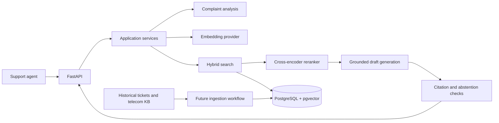

# Architecture

## Intended request flow

The planned API accepts a raw complaint, obtains a structured analysis (intent/category, product, severity, and sentiment), retrieves relevant sources, reranks candidates, and asks an LLM to draft a step-by-step response grounded in those sources. A citation validator checks that citations refer to retrieved source identifiers. If evidence or confidence is insufficient, the response should abstain or recommend escalation for agent review.

This diagram describes the target design, not implemented functionality. The initial deployment can remain a single API service with clear Python module boundaries. A separate ingestion worker can be introduced when data refresh needs it.

## Module boundaries

- `app/domain` defines provider-independent records and protocols.
- `app/services` will coordinate use cases through those protocols; HTTP handlers should not call model or database vendors directly.
- `app/infrastructure` will contain concrete embedding, LLM, search, reranking, and persistence adapters.
- `app/api` validates transport input and presents results to clients.
- `app/core` owns runtime configuration and cross-cutting concerns.

No database schema or concrete AI adapter is defined yet.

## Data provenance and safety

The historical source is a filtered subset of a heterogeneous public support dataset, not a telecom dataset. Its answers may be generic or incorrect and must remain historical evidence rather than authoritative resolution ground truth. Telecom-specific domain guidance belongs in a separate knowledge base with its own provenance and freshness metadata.

Future responses should cite retrieved source IDs, validate every citation against the candidate set, and make uncertainty visible to agents. Credentials must be supplied through environment variables or a secret manager, never committed. Avoid recording raw complaint text in logs by default.
