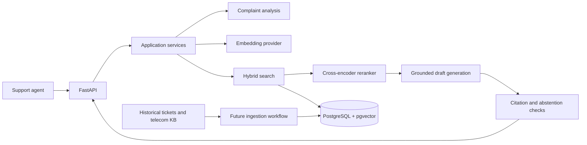

# Architecture

## Historical ticket ingestion

`python -m app.ingestion.cli <saved-dataset-path>` loads the Hugging Face `DatasetDict` from disk, reads only `train`, validates the core columns, maps optional values to SQL `NULL`, and writes bounded batches through a repository protocol. The source dataset identifier, split, row index, and saved dataset fingerprint are retained for provenance. The real corpus remains external to the repository.

The persistence schema has a `historical_tickets` table with a surrogate integer primary key and a unique `(source_dataset, source_split, source_record_id)` key. The latter makes repeat imports idempotent. Original subject, body, and agent answer text are stored without trimming or rewriting. The answer remains historical evidence, not a verified resolution. The source does not provide a ticket-created timestamp, so the schema records only first-ingested and last-seen timestamps.

Tags live in `historical_ticket_tags` with one-based source column positions and a `(ticket_id, position)` primary key. This preserves sparse tag positions and permits indexed tag lookup. Metadata indexes cover ticket type, queue, priority, and language.

The ingestion implementation depends on a historical-ticket repository interface. A future telecom knowledge-base ingestion flow can implement its own source model and repository without changing this dataset adapter or recasting historical tickets as telecom content.

## Historical ticket embedding pipeline

`python -m app.embeddings.cli` coordinates the existing `EmbeddingProvider` port, a Sentence Transformers adapter, and a ticket embedding repository. It reads `historical_tickets` in primary-key order with bounded pages, builds model input from subject/body only, hashes the exact source fields, and writes each generated batch in its own transaction. Empty subject/body pairs are explicitly skipped and stale vectors are deleted if text later becomes empty. Existing vectors are reused only when model identifier, dimension, and source hash still match.

The configurable default model is `sentence-transformers/paraphrase-multilingual-MiniLM-L12-v2` because the current historical corpus includes German and English records. The adapter loads it locally and derives its output dimension at runtime. `historical_ticket_embeddings` supports multiple model identifiers and stores dimension and text hash with each vector. The migration uses an unconstrained pgvector column; after model load, the repository creates a cosine HNSW expression index for that model and actual dimension. This avoids hardcoding model width in the schema while keeping each index dimension-specific. Pin `EMBEDDING_MODEL_REVISION` for reproducible model identity.

The historical `answer` is not part of the embedding input. The source dataset is heterogeneous public support data, not telecom-specific; vectors represent historical subject/body text, not validated solutions.

## Intended resolution request flow

The planned API accepts a raw complaint, obtains a structured analysis (intent/category, product, severity, and sentiment), retrieves relevant sources, reranks candidates, and asks an LLM to draft a step-by-step response grounded in those sources. A citation validator checks that citations refer to retrieved source identifiers. If evidence or confidence is insufficient, the response should abstain or recommend escalation for agent review.

This diagram describes the future resolution flow, not implemented functionality. The initial deployment can remain a single API service with clear Python module boundaries. A separate ingestion worker can be introduced when data refresh needs it.

## Module boundaries

- `app/domain` defines provider-independent records and protocols.
- `app/services` will coordinate use cases through those protocols; HTTP handlers should not call model or database vendors directly.
- `app/infrastructure` will contain concrete embedding, LLM, search, reranking, and persistence adapters.
- `app/api` validates transport input and presents results to clients.
- `app/core` owns runtime configuration and cross-cutting concerns.

No database schema or concrete AI adapter is defined yet.

## Data provenance and safety

The historical source is a filtered subset of a heterogeneous public support dataset, not a telecom dataset. Its answers may be generic or incorrect and must remain historical evidence rather than authoritative resolution ground truth. Telecom-specific domain guidance belongs in a separate knowledge base with its own provenance and freshness metadata.

Future responses should cite retrieved source IDs, validate every citation against the candidate set, and make uncertainty visible to agents. Credentials must be supplied through environment variables or a secret manager, never committed. Avoid recording raw complaint text in logs by default.
