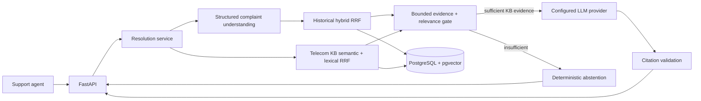

# Architecture

## Historical ticket ingestion

`python -m app.ingestion.cli <saved-dataset-path>` loads the Hugging Face `DatasetDict` from disk, reads only `train`, validates the core columns, maps optional values to SQL `NULL`, and writes bounded batches through a repository protocol. The source dataset identifier, split, row index, and saved dataset fingerprint are retained for provenance. The real corpus remains external to the repository.

The persistence schema has a `historical_tickets` table with a surrogate integer primary key and a unique `(source_dataset, source_split, source_record_id)` key. The latter makes repeat imports idempotent. Original subject, body, and agent answer text are stored without trimming or rewriting. The answer remains historical evidence, not a verified resolution. The source does not provide a ticket-created timestamp, so the schema records only first-ingested and last-seen timestamps.

Tags live in `historical_ticket_tags` with one-based source column positions and a `(ticket_id, position)` primary key. This preserves sparse tag positions and permits indexed tag lookup. Metadata indexes cover ticket type, queue, priority, and language.

The ingestion implementation depends on a historical-ticket repository interface. A future telecom knowledge-base ingestion flow can implement its own source model and repository without changing this dataset adapter or recasting historical tickets as telecom content.

## Historical ticket embedding pipeline

`python -m app.embeddings.cli` coordinates the existing `EmbeddingProvider` port, a Sentence Transformers adapter, and a ticket embedding repository. It reads `historical_tickets` in primary-key order with bounded pages, builds model input from subject/body only, hashes the exact source fields, and writes each generated batch in its own transaction. Empty subject/body pairs are explicitly skipped and stale vectors are deleted if text later becomes empty. Existing vectors are reused only when model identifier, dimension, and source hash still match.

The configurable default model is `sentence-transformers/paraphrase-multilingual-MiniLM-L12-v2` because the current historical corpus includes German and English records. The adapter loads it locally and derives its output dimension at runtime. `historical_ticket_embeddings` supports multiple model identifiers and stores dimension and text hash with each vector. The migration uses an unconstrained pgvector column; after model load, the repository creates a cosine HNSW expression index for that model and actual dimension. This avoids hardcoding model width in the schema while keeping each index dimension-specific. Pin `EMBEDDING_MODEL_REVISION` for reproducible model identity.

The historical `answer` is not part of the embedding input. The source dataset is heterogeneous public support data, not telecom-specific; vectors represent historical subject/body text, not validated solutions.

## Semantic historical-ticket retrieval

POST /v1/retrieval/semantic passes the trimmed query through the existing EmbeddingProvider abstraction and sends the resulting vector to SemanticTicketSearchRepository. The provider is created with the configured embedding model and optional pinned revision already used by the embedding pipeline; no separate model loader or query vector implementation is introduced. The service rejects blank queries and requires the stored corpus's 384-dimensional model.

The SQLAlchemy adapter filters by exact model_identifier and embedding_dimension, computes pgvector cosine distance in PostgreSQL, and limits the ordered results there. Its vector cast matches the model/dimension-specific HNSW cosine expression index. Each result carries historical answer text, ticket metadata, tags, and existing dataset provenance; the raw vector is excluded. The API similarity is 1 - cosine_distance (higher means closer in cosine direction). It ranks candidates for a given query and is not a probability or correctness guarantee. top_k defaults to 5 and is bounded to 1–20.

## Hybrid retrieval

POST /v1/retrieval/hybrid reuses the semantic retrieval service, so the configured multilingual query embedder is loaded once and semantic-only retrieval keeps the same route and response. The lexical adapter searches the generated historical_tickets.search_vector over subject and body only. Its PostgreSQL simple-config tsvector coalesces NULL text fields and is indexed with GIN. The lexical query builder removes common English/German function words and ORs the remaining terms; ts_rank_cd orders matches by term coverage. PostgreSQL full-text search was chosen because tickets and vectors already live in PostgreSQL; it avoids running and refreshing a second search service.

The hybrid service requests independently configurable semantic and lexical candidate lists, then fuses their one-based rankings using Reciprocal Rank Fusion: score(d) = sum(1 / (k + rank)) for each list containing document d. This avoids directly averaging raw cosine and ts_rank_cd values, which use different scales. A document in both lists receives both contributions; a document in either list remains eligible. The fused value is a rank aggregation score, not confidence. Results retain modality ranks and raw modality scores. Defaults: 20 candidates per channel and k=60; final top_k is bounded to 20.

## Intended resolution request flow

POST `/v1/complaints/understand` uses the configured LLM provider to classify a complaint into controlled intent, category, product, severity, and sentiment labels. Intent/category/product lists are configurable through environment variables; each includes `unknown` so novel or unclear tickets do not require code or enum changes. Provider output is validated against the same schema before it reaches the response. A small deterministic triage layer raises severity for explicit SIM-swap/account-security and complete-outage phrases, and lowers general inquiries; this is an advisory safeguard, not carrier policy. Sentiment is descriptive and does not drive troubleshooting. The parser does not log complaint text.

POST `/v1/resolutions` parses the complaint first, then retrieves bounded candidates through the existing historical hybrid RRF and KB semantic/lexical RRF services, filters for relevant KB evidence, and asks the configured LLM provider for a structured step-by-step draft. Its response includes the validated complaint understanding alongside the cited resolution. This checkout currently exposes a `Reranker` protocol but contains no concrete cross-encoder adapter, so resolution generation preserves the existing RRF ordering rather than silently substituting another reranker.

The standalone complaint route and resolution flow share the same service, taxonomy, and LLM provider abstraction. Both validate labels against the configured controlled vocabulary; classification is an operational aid and must be evaluated against reviewed complaint labels before being treated as reliable.

This flow is implemented by the current resolution endpoint. There is no concrete cross-encoder adapter in this checkout; candidate ordering is the existing RRF ordering. A separate ingestion worker can be introduced if KB data refresh needs it.

The RAG endpoint is the first implemented version of that flow. Retrieval precedes generation so the model receives a bounded evidence set rather than answering freely from general knowledge. The service sends KB articles and historical tickets in separately labeled sections. Telecom KB guidance is authoritative for troubleshooting/policy; historical tickets are contextual examples and their agent answers are not verified resolution truth. Prompting expresses that precedence, while citation IDs are independently checked against retrieved candidates and mapped to titles/types by the application. A deterministic relevance gate abstains and recommends escalation when there is no sufficiently relevant KB evidence. This is safer than asking the model to decide whether evidence is adequate or to invent a confidence score.

`LLMProvider` accepts system/user prompts and a JSON schema, and returns a JSON-shaped mapping. `OpenAICompatibleLLMProvider` is the current configurable infrastructure adapter and uses the standard Chat Completions-compatible HTTP shape without a vendor SDK. `LLM_PROVIDER=disabled` prevents accidental provider calls when setup is missing. The route at `app/api/routes/resolutions.py` validates the HTTP request and maps the service result; evidence filtering, prompts, provider invocation, abstention, and citation validation are in `app/services/resolution.py`.

## Module boundaries

- `app/domain` defines provider-independent records and protocols.
- `app/services` coordinate use cases through those protocols; HTTP handlers should not call model or database vendors directly.
- `app/infrastructure` contains concrete embedding, LLM, search, and persistence adapters.
- `app/api` validates transport input and presents results to clients.
- `app/core` owns runtime configuration and cross-cutting concerns.

The current database schema and concrete historical embedding/search adapters are defined in app/infrastructure/persistence; future adapters should continue to implement the domain ports.

## Separate telecom knowledge base

`knowledge_base/seeds/v1/documents.json` is a versioned, committed, synthetic-curated demonstration seed, not copied carrier procedure. The distinct `knowledge_documents` table stores stable IDs, title/procedure, category, product, severity, escalation conditions, source/version, content hash, timestamps, and a generated simple-config PostgreSQL tsvector with a GIN index. `knowledge_document_embeddings` stores model-specific vectors keyed by document and model, and does not share rows or indexes with `historical_ticket_embeddings`.

The KB ingestion CLI (`python -m app.knowledge.cli`) upserts source documents by stable ID and hashes all fields. An unchanged hash preserves the record and vector; a changed hash updates the document and regenerates only its KB vector. The existing embedding provider/model configuration is reused. The KB search service queries its own lexical and vector repositories then applies RRF; the API route remains a thin transport adapter at POST `/v1/knowledge/search`.

Lexical retrieval is valuable for exact technical tokens such as E4037, identifiers that may not be represented robustly by embedding similarity. Semantic retrieval finds relevant procedures when a customer paraphrases an issue, for example “my digital SIM won't activate” without naming eSIM or an error code. PostgreSQL is reused because it already holds ticket data and pgvector indexes; using its full-text and vector capabilities avoids another database service for this prototype. The future RAG service can retrieve both KB articles and historical cases while retaining their separate source types and reliability: telecom guidance is authoritative curated evidence, whereas the heterogeneous ticket corpus is only historical support evidence. It must cite source IDs, validate citations, and abstain/escalate if evidence is inadequate.

## Data provenance and safety

The historical source is a filtered subset of a heterogeneous public support dataset, not a telecom dataset. Its answers may be generic or incorrect and must remain historical evidence rather than authoritative resolution ground truth. Telecom-specific domain guidance belongs in a separate knowledge base with its own provenance and freshness metadata.

Future responses should cite retrieved source IDs, validate every citation against the candidate set, and make uncertainty visible to agents. Credentials must be supplied through environment variables or a secret manager, never committed. Avoid recording raw complaint text in logs by default.
